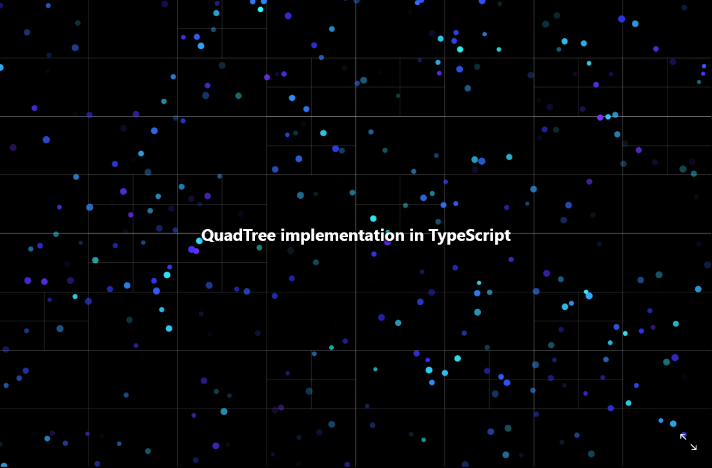

# A Quadtree implementation in Typescript

[](https://GitHub.com/JnxF/QuadTree/stargazers/)
[](https://GitHub.com/JnxF/QuadTree/network/)
[](https://github.com/JnxF/QuadTree)
[](https://GitHub.com/JnxF/QuadTree/graphs/contributors/)
[](https://github.com/JnxF/QuadTree/blob/master/LICENSE)



The code is based on The Coding Train's [Quadtree video series](https://www.youtube.com/watch?v=OJxEcs0w_kE).


## Installation

Navigate to the root folder and install the dependencies with [npm](https://www.npmjs.com/).

```bash
npm install
```

## Usage

Compile with Typescript.

```bash
npm run compile
```

Then open `src/index.html` in a browser.

## License
[MIT](https://choosealicense.com/licenses/mit/)
